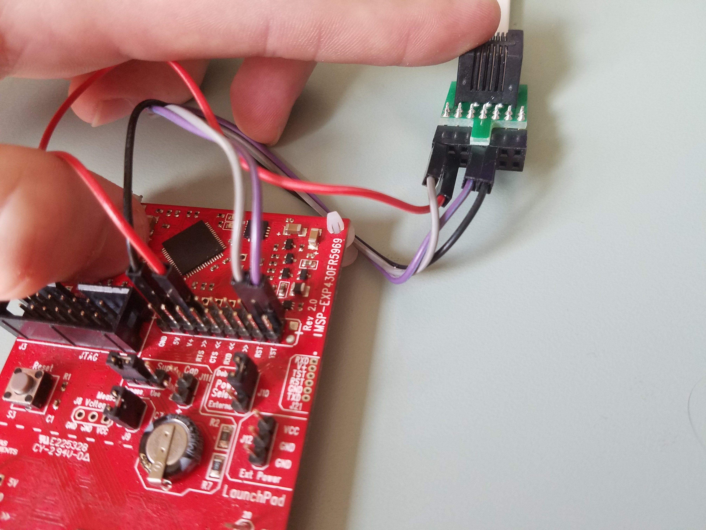

Preface
====
If you do not already have the Amulet hardware, or have not yet set it up, please refer to our hardware guide [here](hardware/README.md) for help.

#### Table of Contents

- [Setup an Amulet Build Environment on Mac OSX](#setup-an-amulet-build-environment-on-mac-osx)
- [Setup an Amulet Build Environment on Linux](#setup-an-amulet-build-environment-on-linux)
- [Setup an Amulet Firmware Toolchain Config File](#setup-an-amulet-firmware-toolchain-config-file)
- [Program an Amulet Device](#program-an-amulet-device)
- [Troubleshooting](#troubleshooting)
- [BLE Development](#ble-development)

Setup an Amulet Build Environment on Mac OSX
===
**NOTE: To be able to do this you may need to disable the System Integrity Protection (SIP). This can be done by booting into recovery mode (⌘ + R on boot) and accessing the Terminal (Utilities > Terminal). To disable type the command `csrutil disable` followed by reboot to restart your machine.**

1. [Download and install GCC compiler and tools using the installer for Mac OSX.](http://software-dl.ti.com/msp430/msp430_public_sw/mcu/msp430/MSPGCC/latest/index_FDS.html)

2. Download the amulet repo with the following command, which will make sure that you also get all of the associated submodules.

		git clone --recursive https://github.com/AmuletGroup/amulet-project.git

3. Run `buildscript-mac` to setup your development environment.


Setup an Amulet Build Environment on Linux
===
1. [Download the GCC compiler and tools for Linux.](http://software-dl.ti.com/msp430/msp430_public_sw/mcu/msp430/MSPGCC/latest/index_FDS.html)

2. Download the amulet repo with the following command, which will make sure that you also get all of the associated submodules.

		git clone --recursive https://github.com/AmuletGroup/amulet-project.git

3. Run `buildscript-linux` to setup your development environment.


Setup an Amulet Firmware Toolchain Config File
====
The following code is an example of an Amulet Firmware Toolchain (AFT) .config file, and is based off of [this](firmware/aft/example_firmware.config) config file. Please remember to update the following file paths with your own.

	amulet-config:

	    #
	    # Environment Configuration.
	    #

	    #amulet_root is the path to root of the amulet repo
	    amulet_root: ~/Repos/amulet-dev 								# mac build environment
	    # amulet_root: /home/vagrant/Repos/amulet-dev 							# vagrant default build environment

	    #amulet_apps is the path to root of the applications directory
	    amulet_apps: ~/Repos/amulet-dev/applications 					# mac build environment
	    # amulet_apps: /home/vagrant/Repos/amulet-dev/applications          	# vagrant default build environment

	    #qpc_root is the path to root of the lib-qpc repo
	    qpc_root: ~/Repos/amulet-dev/firmware/bsl/lib-qpc            # mac build environment
	    # qpc_root: /home/vagrant/Repos/amulet-dev/firmware/bsl/lib-qpc 		# vagrant default build environment

	    # qmc_path is the path of the qmc executable
	    qmc_path: /Applications/qmc.app/Contents/MacOS 					# mac build environment
	    # qmc_path: /home/vagrant/qm/bin/ 										# vagrant default build environment
	    # qmc_exe is the path to the actual executable, if defined, overrides qmc_path
	    # this is most useful for ubuntu/wine or windows dev environments
	    qmc_exe: wine ~/.wine/drive_c/qp/qm/bin/qmc.exe
    
	    #
	    # Build Configuration.
	    #

	    # apps provides a list of names of apps that you'd like to include in the firmware.
	    apps:
	        - name: clock
	        - name: heartrate

	    # device configuration is denoted using config. The value for config is directly used as a define C flag
	    config: BSP_SNAIL_KITE

	    # flags are set to build firmware process. You can specify flags here, or on the command line when invoking the aft script.
	    flags:
	        # if pins is true, the -t flag is set to add toggle pin code
	        pins: false

	        # if aft is true, the -p flag is set and apps go through AFT translation and runtime checks
	        aft: true

	        # if resource-profiling is true, the -r flag is set and resource usage/energecy consumption information is produced
	        resource_profiling: true

	    compiler: gcc
	    gcc_root: ~/ti/gcc/bin

Program an Amulet Device
====
1. Make sure that your .config file contains all of the apps that you want to run on the Amulet.

2. If you HAVE NOT compiled a firmware image before, then you will first need to compile the build system. To do this, navigate to ``amulet-dev/firmware/aft``, and run the following command. This will compile the build system, as well as compile your firmware image. If you don't want to see all of the output, then leave out the ``--verbose`` flag.

		./aft --all --verbose --rebuild-abt Path_To_Your_Config_File/[your_config_file].config

3. If you already compiled the build system, then you can use the following command inside of the ``amulet-dev/firmware/aft`` folder to compile your firmware image. If, for whatever reason, you want to re-compile the build system, then use the above command instead. Again, ``--verbose`` is optional.

		./aft --all --verbose Path_To_Your_Config_File/[your_config_file].config

4. Connect your Amulet to the computer using the [TagConnect JTAG Dongle](http://www.tag-connect.com/what-is-tag-connect) connected to a programmer; this programmer can either be a MSP430FET, or a MSP430FRX9X9 launchpad. If you are using a launchpad, the picture below shows how to hook up the TagConnect [SPI-BI-WIRE connector](media/tag-connect-spi-bi-wire.jpg) and [POGO PIN wire](media/tag-connect-pogo-wire.jpg) to a launchpad.

	<div>
		
		<p style="clear: both;">
	</div>  

5. Run the following command to install the firmware image onto your Amulet. Afterwards, the device should be fully programmed and ready to use. You should see a clock on the display with the current time.

		./aft --install-binary Path_To_Your_Config_File/[your_config_file].config

When you first run the above command you might get a message indicating that your firmware needs to be updated. If that is the case, run the `mspdebug tilib —allow-fw-update`. Ignore this note if you don't see that message.

You can see an in depth explanation of how the aft works and it's flag options [here.](firmware/aft/README.md)

## Coding Style

You should write comment with [doxygen](http://www.stack.nl/~dimitri/doxygen/) style.
Generally, all Amulet API should start with Amulet prefix.
All middle layer API between Amulet API and BSP(board support) should start with the Core prefix.
Include headers in c file instead of h file.
It is recommended to use clang format for all the C code (Both Sublime and Atom have clang formatter plugin)

**NOTE:** *We are using the Doxygen formatting style for generating documentation from comments in our source code. Please refer to the [Doxygen](http://www.stack.nl/~dimitri/doxygen/manual/docblocks.html) documentation for details on how to format comments.*

Troubleshooting
====
Use the -d option in AFT to start debugging the firmware, it will break on main, then you use GDB as usual.
I also recommend you print debug message on the Sharp display, use the following to print and clear:
`BSP_display_clr();`
`BSP_display("IPC interrupt", 1);`
The second parameter is the line number.

UART debug has been removed from this document as UART no longer exist in our current hardware rev. If you need that, please find them in git history.

If you have trouble going into gdb with ./aft -d script, you can try to manually start debugging session with command in the `src/aft/tools.gdb.cmd`

Inevitably you will encounter issues while developing different aspects of the amulet system, be it with application development, amulet-os development, BSP development, AFT development, or something else. This page exists to capture information about some known issues and may help you resolve a problem you have.

## Cannot merge apps into a single file

When using the AFT to build a firmware image for the amulet you may encounter a message similar to this:

```
SUCCESS:: App built successfully
...adding EmergencyResponse
Error...Step failed. Exiting!
```

It may be that the location of QM tool is not correct. The `aft` script assumes that you have QM installed and specifies a variable called `qpc_root` where you are supposed to specify the location of the `qmc` executable (you should have set this while you were following the "getting started" instructions).

## One of the core state machine stop working
The queue(s) for the state machine can fill up quickly if you carelessly use them (ex. if you create an event but do not use it). The best practice is to create an event right before you are about to post it.

```
AmuletSensorsEvt *timeReqEvt;
timeReqEvt = Q_NEW(AmuletSensorsEvt, AMULET_REQ_CHANGE_SIG);
QACTIVE_POST(getAppActiveObject(GlobalAppQueueHead, subscribedAppID), &timeReqEvt->super, NULL);
```

BLE Development
====
You can view our guide on BLE development [here.](firmware/ble/README.md)
