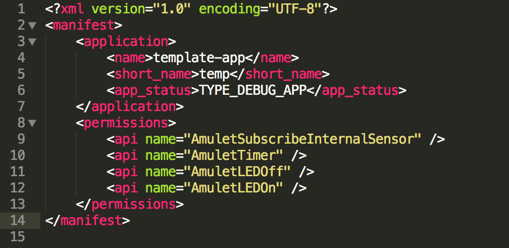
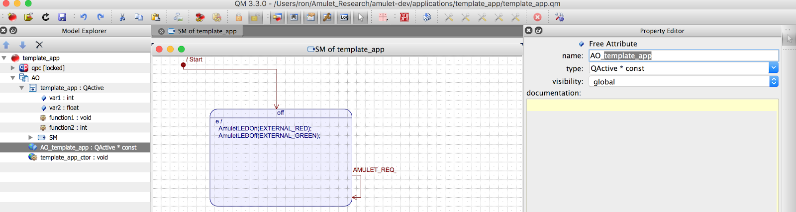
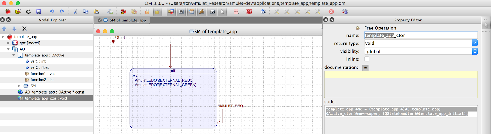
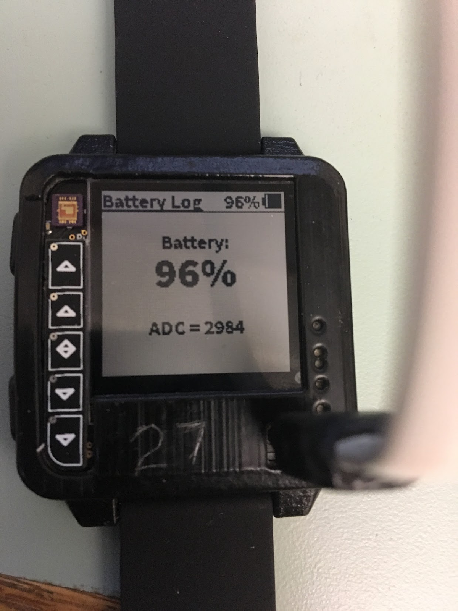

#### Table of Contents

- [API Documentation](#api-documentation)
- [Creating a New Project](#creating-a-new-project)
- [Setup an Amulet Firmware Toolchain Config File](#setup-an-amulet-firmware-toolchain-config-file)
- [Program an Amulet Device](#program-an-amulet-device)
- [Troubleshooting](#troubleshooting)

API Documentation
===
When developing applications ("apps"), you will likely want to make function calls into the system to do things like get data from a sensor, write information to a log, or update the display with information from your app --- just to name a few examples. You can find the relevant Amulet APIs here: [http://www.cs.dartmouth.edu/~amulet/docs/files.html](http://www.cs.dartmouth.edu/~amulet/docs/files.html). In order to access the docs stored on the dartmouth servers you'll need the login information: 

**username:** amuletdev

**password:** r4UaStr7OdcK4OcuUY4FN

**NOTE:** *It used to be that applications were required to specify a "requestor ID" as part of any call made to the underlying amulet system. The AFT now automatically inserts this to ensure that apps are honest when providing this ID. Therefore, you should not add any argument manually to attempt to tell the system which app is calling the function as this will be handled automatically*.

Creating a New Project
===

1. Go to `/amulet-project/applications/`
2. Duplicate the folder `template_app` and change its name to your app’s name. You can do that in the termal with the following commands 

		cp -R template_app your_app_name

3. There are three files in there: `template_app.qm`, `template_app.xml` and `README.txt`. Change the names of the qm and xml files to your app’s name. Make sure the name matches exactly the name of your app’s folder. You can use the following commands in your terminal.

		mv your_app_name/template_app.qm your_app_name/your_app_name.qm
		mv your_app_name/template_app.xml your_app_name/your_app_name.xml

4. Open the `README.txt file` and update it with a description of purpose of your app 
5. Open `your_app_name.xml` file 
	
	* Under the `<application>` header, update
		* `<name>` with your app’s name
		* `<short_name>` with a short version of your apps name
		* `<app_status>` with the category of your app. The categories are described in [Amulet API documentation](http://www.cs.dartmouth.edu/~amulet/docs/files.html).

	* Under the `<permissions>` header, update with the Amulet APIs you will use in your app. The APIs are described in the  [Amulet API document](http://www.cs.dartmouth.edu/~amulet/docs/files.html). You can always come back and update it as you create your app. Not including an API you are using in your app will result in an error at compile time. This is similar to the "Manifest" file used by every Android application.

	<div>
		
		<p style="clear: both;">
	</div>
	
6. Open the `your_app_name.qm` file using the qm application
7. Replace every instance  `template_app` with the name of your app.

	<div>
		
		<p style="clear: both;">
	</div>
	
	<div>
		
		<p style="clear: both;">
	</div>

Setup an Amulet Firmware Toolchain Config File
===

The following code is an example of an Amulet Firmware Toolchain (AFT) .config file, and is based off of [this](../firmware/aft/example_firmware.config) config file. Please remember to update the following file paths with your own.

	amulet-config:

	    #
	    # Environment Configuration.
	    #

	    #amulet_root is the path to root of the amulet repo
	    amulet_root: ~/Repos/amulet-project

	    #amulet_apps is the path to root of the applications directory
	    amulet_apps: ~/Repos/amulet-project/applications 

	    #qpc_root is the path to root of the lib-qpc repo
	    qpc_root: ~/Repos/amulet-project/firmware/bsl/lib-qpc

	    # qmc_path is the path of the qmc executable
	    qmc_path: /Applications/qmc.app/Contents/MacOS
	    
	    # qmc_exe is the path to the actual executable, if defined, overrides qmc_path
	    # this is most useful for ubuntu/wine or windows dev environments
	    # qmc_exe: wine ~/.wine/drive_c/qp/qm/bin/qmc.exe
    
	    #
	    # Build Configuration.
	    #

	    # apps provides a list of names of apps that you'd like to include in the firmware.
	    apps:
	        - name: clock
	        - name: heartrate

	    # device configuration is denoted using config. The value for config is directly used as a define C flag
	    config: BSP_SNAIL_KITE

	    # flags are set to build firmware process. You can specify flags here, or on the command line when invoking the aft script.
	    flags:
	        # if pins is true, the -t flag is set to add toggle pin code
	        pins: false

	        # if aft is true, the -p flag is set and apps go through AFT translation and runtime checks
	        aft: true

	        # if resource-profiling is true, the -r flag is set and resource usage/energecy consumption information is produced
	        resource_profiling: true

	    compiler: gcc
	    gcc_root: ~/ti/gcc/bin

Program an Amulet Device
===

1. Make sure that your .config file contains all of the apps that you want to run on the Amulet.

2. If you HAVE NOT compiled a firmware image before, then you will first need to compile the build system. To do this, navigate to ``amulet-dev/firmware/aft``, and run the following command. This will compile the build system, as well as compile your firmware image. If you don't want to see all of the output, then leave out the ``--verbose`` flag.

		./aft --all --verbose --rebuild-abt Path_To_Your_Config_File/[your_config_file].config

3. If you already compiled the build system, then you can use the following command inside of the ``amulet-dev/firmware/aft`` folder to compile your firmware image. If, for whatever reason, you want to re-compile the build system, then use the above command instead. Again, ``--verbose`` is optional.

		./aft --all --verbose Path_To_Your_Config_File/[your_config_file].config

4. Connect your Amulet to the computer using the [TagConnect JTAG Dongle](http://www.tag-connect.com/what-is-tag-connect) connected to a programmer; this programmer can either be an [MSP430FET](http://www.ti.com/tool/msp-fet), or an MSP430FRX9X9 launchpad. If you are using a launchpad, the picture below shows how to hook up the TagConnect [SPI-BI-WIRE connector](../media/tag-connect-spi-bi-wire.jpg) and [POGO PIN wire](../media/tag-connect-pogo-wire.jpg) to a launchpad.

	<div>
		
		<p style="clear: both;">
	</div>  

5. Plug the programmer into the Amulet (as shown below) and run the following command to install the firmware image onto your Amulet. Afterwards, the device should be fully programmed and ready to use.

	<div>
		
		<p style="clear: both;">
	</div>

		./aft --install-binary Path_To_Your_Config_File/[your_config_file].config

When you first run the above command you might get a message indicating that your firmware needs to be updated. If that is the case, run the `mspdebug tilib —allow-fw-update`. Ignore this note if you don't see that message.

You can see an in depth explanation of how the aft works and it's flag options [here.](../firmware/aft/README.md)


Troubleshooting
===

Use the -d option in AFT to start debugging the firmware, it will break on main, then you use GDB as usual.
I also recommend you print debug message on the Sharp display, use the following to print and clear:
`BSP_display_clr();`
`BSP_display("IPC interrupt", 1);`
The second parameter is the line number.

If you have trouble going into gdb with ./aft -d script, you can try to manually start debugging session with command in the `src/aft/tools.gdb.cmd`

### Cannot merge apps into a single file
When using the AFT to build a firmware image for the amulet you may encounter a message similar to this:

```
SUCCESS:: App built successfully
...adding EmergencyResponse
Error...Step failed. Exiting!
```

It may be that the location of QM tool is not correct. The `aft` script assumes that you have QM installed and specifies a variable called `qpc_root` where you are supposed to specify the location of the `qmc` executable (this is specified in your config file).

### One of the core state machine stop working
The queue(s) for the state machine can fill up quickly if you carelessly use them (ex. if you create an event but do not use it). The best practice is to create an event right before you are about to post it.

```
AmuletSensorsEvt *timeReqEvt;
timeReqEvt = Q_NEW(AmuletSensorsEvt, AMULET_REQ_CHANGE_SIG);
QACTIVE_POST(getAppActiveObject(GlobalAppQueueHead, subscribedAppID), &timeReqEvt->super, NULL);
```
