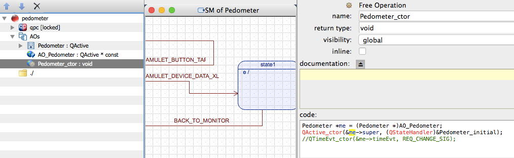

Software
===
# Develop Amulet Apps

* The best way to start is by copying an existing app folder and changing it for your app. Apps we recommend to start with including Blinky, Fall Detection, EMA, Heartrate, Pedometer, and Clock.

You need to change the following to create your own app from the example app:
* The file names of the QM and XML file; the app folder name.
* The name of the constructor, the active object, and the code for constructor. In the following example, you should just use property editor to replace all "Pedometer" text to your own app name

* Replace the app name in the xml file with your own app's name

* When developing applications ("apps"), you will likely want to make function calls into the system to do things like get data from a sensor, write information to a log, or update the display with information from your app --- just to name a few examples. You can find the relevant Amulet APIs here: [http://www.cs.dartmouth.edu/~amulet/docs/files.html](http://www.cs.dartmouth.edu/~amulet/docs/files.html). In order to access the docs stored on the dartmouth servers you'll need the login information: 

	* **username:** amuletdev
	* **password:** r4UaStr7OdcK4OcuUY4FN

	* **NOTE:** *It used to be that applications were required to specify a "requestor ID" as part of any call made to the underlying amulet system. The AFT now automatically inserts this to ensure that apps are honest when providing this ID. Therefore, you should not add any argument manually to attempt to tell the system which app is calling the function as this will be handled automatically*.

* Something important to note is that we envision the amulet to be a very *secure* platform for applications to run on. One aspect of accomplishing this is making sure that applications only have permission to do the things they need to do: no more, no less. Currently, we require each app to include a meta data file similar to the "Manifest" files used by every Android application. To see an example of such a file, take a look at the [Bite Counter app "manifest" flie](bite_counter/bite_counter.xml). 

	* The best/easiest way to get started is to copy an `.xml` file from another app folder such as the one linked above.

* The amulet is unique in that applications run as "state machines." This is actually what allows us to make amulet run on such little power --- when an application doesn't need to be doing anything, we can put the processor into a very low power mode. Here is a link to the [Official Documents](http://state-machine.com/qm/) for QM with great information on how to design applications as state machines.

## Coding Style

You should write comment with [doxygen](http://www.stack.nl/~dimitri/doxygen/) style. 
Generally, all Amulet API should start with Amulet prefix.
All middle layer API between Amulet API and BSP(board support) should start with the Core prefix.
Include headers in c file instead of h file.
It is recommended to use clang format for all the C code (Both Sublime and Atom have clang formatter plugin) 

**NOTE:** *We are using the Doxygen formatting style for generating documentation from comments in our source code. Please refer to the [Doxygen](http://www.stack.nl/~dimitri/doxygen/manual/docblocks.html) documentation for details on how to format comments.*

